# GulioSmart Retail POS — Database / ERD

| Field | Value |
| --- | --- |
| **Engine** | PostgreSQL |
| **ORM** | Prisma (`packages/database`) |
| **Tenancy** | `organization_id` on all tenant rows; operational scope via `branch_id` / `warehouse_id` |
| **Money** | `Decimal` (Prisma `Decimal` / PostgreSQL `NUMERIC`) — never float |
| **Stock** | Append-only `stock_movements`; balances are projections |
| **Status** | Draft for **client ERD approval** before first production migration |

Related: `docs/product-requirements.md` · `AGENTS.md` · `docs/architecture.md`

---

## 1. Principles

1. **Multi-tenant isolation** — every query filters by `organization_id` from auth context.
2. **Ledger inventory** — no direct quantity mutation without a movement row.
3. **Financial immutability** — completed sales/payments are not updated in place; use void/refund/reversal documents.
4. **Decimal money** — amounts, tax, discounts, costs use `Decimal(19, 4)` (or org minor-unit integers — pick one per migration; **recommended: Decimal**).
5. **Idempotency** — checkout and external callbacks store keys uniquely per org.
6. **Phase markers** — entities tagged `(P2)` are created in schema early **or** deferred migrations; either way they appear on this ERD for approval. Prefer **schema-ready, UI later** for purchasing/fiscal/sync tables that the interfaces already need.

---

## 2. Field notes (global)

| Concern | Convention |
| --- | --- |
| Primary keys | UUID (`id`) |
| Timestamps | `created_at`, `updated_at` (UTC); soft delete only where justified (`deleted_at`) |
| Money | `Decimal` — e.g. `unit_price`, `line_total`, `amount_tendered` |
| Qty | `Decimal(19, 4)` for loose qty; serial lines typically qty `1` per serial |
| Enums | Prisma enums or check constraints; document in schema |
| Serial statuses | `IN_STOCK` \| `RESERVED` \| `SOLD` \| `RETURNED` \| `DAMAGED` \| `IN_REPAIR` \| `SUPPLIER_RETURN` \| `TRANSFERRED` |
| Sale status | `DRAFT` \| `HELD` \| `COMPLETED` \| `VOIDED` |
| Fiscal status | `NOT_REQUIRED` \| `FISCAL_PENDING` \| `FISCAL_OK` \| `FISCAL_FAILED` |
| Idempotency | Unique `(organization_id, idempotency_key)` on sales (and later payments/webhooks) |

### 2.1 Serial status meanings

| Status | Meaning |
| --- | --- |
| `IN_STOCK` | Sellable in warehouse |
| `RESERVED` | Soft-hold (optional MVP; cart reservation) |
| `SOLD` | Linked to completed sale line |
| `RETURNED` | Customer return; may transition to `IN_STOCK` if restocked |
| `DAMAGED` | Not sellable |
| `IN_REPAIR` | Warranty/repair path (P2 workflow heavy) |
| `SUPPLIER_RETURN` | Sent back to supplier (P2) |
| `TRANSFERRED` | In transit / at other warehouse (P2) |

---

## 3. Entity groups

| Group | Phase 1 | Phase 2 (+) |
| --- | --- | --- |
| Org / auth | Organization, Branch, Warehouse, Register, RegisterSession, User, Role, Permission, UserRole | — |
| Catalog | Brand, Category, Product, Variant, Barcode, PriceHistory | ExternalProductMap |
| Inventory | SerialUnit, StockMovement, StockBalance, StockCount (light) | Transfer, TransferLine |
| Sales | Sale, SaleItem, SaleItemSerial, Payment, HeldSale, Return, ReturnItem | Exchange |
| Customers | Customer | LoyaltyAccount, LoyaltyLedger, StoreCredit |
| Purchasing | — (optional stub Supplier) | Supplier, PurchaseOrder, POLine, GoodsReceipt, GRLine, SupplierInvoice |
| Fiscal / integrations | FiscalDocument (stub), OutboxEvent | WebhookDelivery, SyncState, ProviderPayment |
| Audit | AuditLog | — |

---

## 4. Mermaid ERD

Phase 1 entities are unlabeled. Phase 2 entities include `P2` in the entity name suffix or comment via attribute `phase P2`.

```mermaid
erDiagram
  %% ===== ORG / AUTH (Phase 1) =====
  Organization ||--o{ Branch : has
  Organization ||--o{ User : has
  Organization ||--o{ Role : has
  Branch ||--o{ Warehouse : has
  Branch ||--o{ Register : has
  Branch ||--o{ UserBranch : scopes
  User ||--o{ UserBranch : ""
  User ||--o{ UserRole : ""
  Role ||--o{ UserRole : ""
  Role ||--o{ RolePermission : ""
  Permission ||--o{ RolePermission : ""
  Register ||--o{ RegisterSession : shifts
  User ||--o{ RegisterSession : opens

  Organization {
    uuid id PK
    string name
    string slug UK
    string currency_code
    string timezone
    jsonb settings
    datetime created_at
  }

  Branch {
    uuid id PK
    uuid organization_id FK
    string name
    string code
    boolean is_active
  }

  Warehouse {
    uuid id PK
    uuid organization_id FK
    uuid branch_id FK
    string name
    boolean is_default
  }

  Register {
    uuid id PK
    uuid organization_id FK
    uuid branch_id FK
    string name
    string code
    boolean is_active
  }

  RegisterSession {
    uuid id PK
    uuid organization_id FK
    uuid register_id FK
    uuid branch_id FK
    uuid opened_by_user_id FK
    uuid closed_by_user_id FK
    string status
    decimal opening_float
    decimal closing_counted_cash
    decimal expected_cash
    decimal variance
    datetime opened_at
    datetime closed_at
  }

  User {
    uuid id PK
    uuid organization_id FK
    string email UK
    string password_hash
    string full_name
    string pin_hash
    boolean is_active
  }

  Role {
    uuid id PK
    uuid organization_id FK
    string code
    string name
  }

  Permission {
    uuid id PK
    string code UK
    string description
  }

  UserRole {
    uuid user_id FK
    uuid role_id FK
  }

  RolePermission {
    uuid role_id FK
    uuid permission_id FK
  }

  UserBranch {
    uuid user_id FK
    uuid branch_id FK
  }

  %% ===== CATALOG (Phase 1) =====
  Organization ||--o{ Brand : ""
  Organization ||--o{ Category : ""
  Organization ||--o{ Product : ""
  Brand ||--o{ Product : ""
  Category ||--o{ Product : ""
  Product ||--o{ Variant : ""
  Variant ||--o{ Barcode : ""
  Variant ||--o{ PriceHistory : ""

  Brand {
    uuid id PK
    uuid organization_id FK
    string name
  }

  Category {
    uuid id PK
    uuid organization_id FK
    string name
    uuid parent_id FK
  }

  Product {
    uuid id PK
    uuid organization_id FK
    uuid brand_id FK
    uuid category_id FK
    string name
    string description
    boolean is_active
  }

  Variant {
    uuid id PK
    uuid organization_id FK
    uuid product_id FK
    string sku UK
    string name
    jsonb attributes
    decimal sell_price
    decimal cost_price
    string tax_class
    boolean tracks_serial
    boolean is_active
  }

  Barcode {
    uuid id PK
    uuid organization_id FK
    uuid variant_id FK
    string symbology
    string value UK
    boolean is_primary
  }

  PriceHistory {
    uuid id PK
    uuid organization_id FK
    uuid variant_id FK
    decimal sell_price
    uuid changed_by_user_id FK
    datetime effective_at
  }

  %% ===== INVENTORY (Phase 1) =====
  Variant ||--o{ SerialUnit : ""
  Warehouse ||--o{ SerialUnit : ""
  Variant ||--o{ StockBalance : ""
  Warehouse ||--o{ StockBalance : ""
  Variant ||--o{ StockMovement : ""
  Warehouse ||--o{ StockMovement : ""
  User ||--o{ StockMovement : ""

  SerialUnit {
    uuid id PK
    uuid organization_id FK
    uuid variant_id FK
    uuid warehouse_id FK
    string serial_number
    string status
    uuid current_sale_item_id FK
    datetime created_at
  }

  StockBalance {
    uuid id PK
    uuid organization_id FK
    uuid warehouse_id FK
    uuid variant_id FK
    decimal quantity_on_hand
    decimal quantity_reserved
    datetime updated_at
  }

  StockMovement {
    uuid id PK
    uuid organization_id FK
    uuid warehouse_id FK
    uuid variant_id FK
    string movement_type
    decimal quantity_delta
    uuid reference_type
    uuid reference_id
    uuid serial_unit_id FK
    uuid created_by_user_id FK
    string reason
    datetime created_at
  }

  StockCount {
    uuid id PK
    uuid organization_id FK
    uuid warehouse_id FK
    string status
    uuid created_by_user_id FK
    datetime counted_at
  }

  %% ===== CUSTOMERS (Phase 1) =====
  Organization ||--o{ Customer : ""
  Customer ||--o{ Sale : ""

  Customer {
    uuid id PK
    uuid organization_id FK
    string name
    string phone
    string email
    string notes
  }

  %% ===== SALES / PAYMENTS / RETURNS (Phase 1) =====
  RegisterSession ||--o{ Sale : ""
  User ||--o{ Sale : cashier
  Sale ||--o{ SaleItem : ""
  SaleItem ||--o{ SaleItemSerial : ""
  SerialUnit ||--o{ SaleItemSerial : ""
  Sale ||--o{ Payment : ""
  Sale ||--o{ Return : ""
  Return ||--o{ ReturnItem : ""
  SaleItem ||--o{ ReturnItem : ""

  Sale {
    uuid id PK
    uuid organization_id FK
    uuid branch_id FK
    uuid warehouse_id FK
    uuid register_id FK
    uuid register_session_id FK
    uuid cashier_user_id FK
    uuid customer_id FK
    string receipt_number UK
    string status
    string fiscal_status
    string idempotency_key UK
    decimal subtotal
    decimal discount_total
    decimal tax_total
    decimal grand_total
    datetime completed_at
  }

  SaleItem {
    uuid id PK
    uuid organization_id FK
    uuid sale_id FK
    uuid variant_id FK
    decimal quantity
    decimal unit_price
    decimal discount_amount
    decimal tax_amount
    decimal line_total
    boolean tracks_serial
  }

  SaleItemSerial {
    uuid sale_item_id FK
    uuid serial_unit_id FK
  }

  Payment {
    uuid id PK
    uuid organization_id FK
    uuid sale_id FK
    string method
    decimal amount
    string provider
    string reference
    datetime paid_at
  }

  HeldSale {
    uuid id PK
    uuid organization_id FK
    uuid register_id FK
    uuid cashier_user_id FK
    jsonb cart_payload
    datetime expires_at
  }

  Return {
    uuid id PK
    uuid organization_id FK
    uuid sale_id FK
    uuid branch_id FK
    uuid processed_by_user_id FK
    uuid approved_by_user_id FK
    string status
    decimal refund_total
    string reason_code
    datetime processed_at
  }

  ReturnItem {
    uuid id PK
    uuid return_id FK
    uuid sale_item_id FK
    uuid serial_unit_id FK
    decimal quantity
    string disposition
    decimal refund_amount
  }

  %% ===== AUDIT / OUTBOX / FISCAL STUB (Phase 1) =====
  Organization ||--o{ AuditLog : ""
  Organization ||--o{ OutboxEvent : ""
  Sale ||--o| FiscalDocument : ""

  AuditLog {
    uuid id PK
    uuid organization_id FK
    uuid actor_user_id FK
    string action
    string entity_type
    uuid entity_id
    jsonb before_json
    jsonb after_json
    datetime created_at
  }

  OutboxEvent {
    uuid id PK
    uuid organization_id FK
    string event_type
    uuid aggregate_id
    jsonb payload
    string status
    datetime available_at
    datetime processed_at
  }

  FiscalDocument {
    uuid id PK
    uuid organization_id FK
    uuid sale_id FK
    string provider
    string status
    string external_ref
    jsonb request_json
    jsonb response_json
    string idempotency_key
  }

  %% ===== PHASE 2: PURCHASING =====
  Organization ||--o{ Supplier_P2 : ""
  Supplier_P2 ||--o{ PurchaseOrder_P2 : ""
  Branch ||--o{ PurchaseOrder_P2 : ""
  PurchaseOrder_P2 ||--o{ PurchaseOrderLine_P2 : ""
  Variant ||--o{ PurchaseOrderLine_P2 : ""
  PurchaseOrder_P2 ||--o{ GoodsReceipt_P2 : ""
  GoodsReceipt_P2 ||--o{ GoodsReceiptLine_P2 : ""
  Supplier_P2 ||--o{ SupplierInvoice_P2 : ""

  Supplier_P2 {
    uuid id PK
    uuid organization_id FK
    string name
    string phone
    string email
    string phase "P2"
  }

  PurchaseOrder_P2 {
    uuid id PK
    uuid organization_id FK
    uuid supplier_id FK
    uuid branch_id FK
    string status
    string phase "P2"
  }

  PurchaseOrderLine_P2 {
    uuid id PK
    uuid purchase_order_id FK
    uuid variant_id FK
    decimal quantity_ordered
    decimal unit_cost
    string phase "P2"
  }

  GoodsReceipt_P2 {
    uuid id PK
    uuid organization_id FK
    uuid purchase_order_id FK
    uuid warehouse_id FK
    string status
    string phase "P2"
  }

  GoodsReceiptLine_P2 {
    uuid id PK
    uuid goods_receipt_id FK
    uuid variant_id FK
    decimal quantity_received
    string phase "P2"
  }

  SupplierInvoice_P2 {
    uuid id PK
    uuid organization_id FK
    uuid supplier_id FK
    uuid purchase_order_id FK
    decimal amount
    string phase "P2"
  }

  %% ===== PHASE 2: TRANSFERS =====
  Warehouse ||--o{ StockTransfer_P2 : from
  StockTransfer_P2 ||--o{ StockTransferLine_P2 : ""

  StockTransfer_P2 {
    uuid id PK
    uuid organization_id FK
    uuid from_warehouse_id FK
    uuid to_warehouse_id FK
    string status
    string phase "P2"
  }

  StockTransferLine_P2 {
    uuid id PK
    uuid transfer_id FK
    uuid variant_id FK
    decimal quantity
    string phase "P2"
  }

  %% ===== PHASE 2: LOYALTY / WARRANTY / SYNC =====
  Customer ||--o| LoyaltyAccount_P2 : ""
  Variant ||--o{ ExternalProductMap_P2 : ""
  SerialUnit ||--o{ WarrantyRecord_P2 : ""

  LoyaltyAccount_P2 {
    uuid id PK
    uuid customer_id FK
    decimal points_balance
    string phase "P2"
  }

  ExternalProductMap_P2 {
    uuid id PK
    uuid organization_id FK
    uuid variant_id FK
    string external_system
    string external_product_id
    string phase "P2"
  }

  WarrantyRecord_P2 {
    uuid id PK
    uuid organization_id FK
    uuid serial_unit_id FK
    uuid sale_item_id FK
    datetime starts_at
    datetime ends_at
    string status
    string phase "P2"
  }

  ProviderPayment_P2 {
    uuid id PK
    uuid organization_id FK
    uuid payment_id FK
    string provider
    string provider_ref
    string status
    string phase "P2"
  }
```

---

## 5. Critical indexes (Phase 1)

| Table | Index / unique |
| --- | --- |
| `variants` | Unique `(organization_id, sku)` |
| `barcodes` | Unique `(organization_id, value)` |
| `serial_units` | Unique `(organization_id, serial_number)` · index `(warehouse_id, variant_id, status)` |
| `stock_balances` | Unique `(warehouse_id, variant_id)` |
| `stock_movements` | Index `(organization_id, created_at)` · `(reference_type, reference_id)` |
| `sales` | Unique `(organization_id, receipt_number)` · Unique `(organization_id, idempotency_key)` |
| `register_sessions` | Partial unique: one `OPEN` session per `register_id` |
| `payments` | Index `(sale_id)` |
| `audit_logs` | Index `(organization_id, created_at)` · `(entity_type, entity_id)` |
| `outbox_events` | Index `(status, available_at)` |

---

## 6. Money & rounding

- Store currency on `Organization.currency_code` (e.g. `TZS`).
- Line math performed in service layer with Decimal library; persist final Decimal fields.
- Define org-level rounding mode (half-up vs banker’s) in settings — **no hidden hardcodes** in UI only.
- Never use JavaScript `number` for money across API contracts; use string decimal or integer minor units in JSON.

---

## 7. Migration & approval note

> **Stop point:** Do not run the first **production** Prisma migration until this ERD is explicitly approved by the product owner / client technical contact.

Recommended process:

1. Client / owner reviews this document (Phase 1 tables + Phase 2 markers).
2. Confirm: Decimal vs minor units; one warehouse per branch; receipt number scope (org vs branch).
3. `security-agent` / `devops-agent` review tenancy + backup.
4. Apply migrations in dev → staging → prod; no destructive edits to ledger or completed sales tables without expand/contract plan.
5. Phase 2 tables may ship as empty migrations early **if** approved, or wait until Phase 2 kickoff — decide explicitly and record here after approval.

**Approval checklist**

- [ ] Phase 1 entity list accepted
- [ ] Serial status enum accepted
- [ ] Money type accepted (`Decimal`)
- [ ] Phase 2 entities marked understood (not in MVP UI)
- [ ] Named approver + date: __________________

---

## 8. Ownership

| Area | Agent |
| --- | --- |
| ERD / phasing decisions | `product-architect` |
| Prisma schema implementation | Domain agents + shared `packages/database` (coordinate; no cross-module DB access at runtime) |
| Inventory tables semantics | `inventory-agent` |
| Sales/payment tables semantics | `sales-agent` |
| Auth/org tables | `security-agent` |
| Purchasing (P2) | `purchasing-agent` |

---

*End of database / ERD documentation.*
