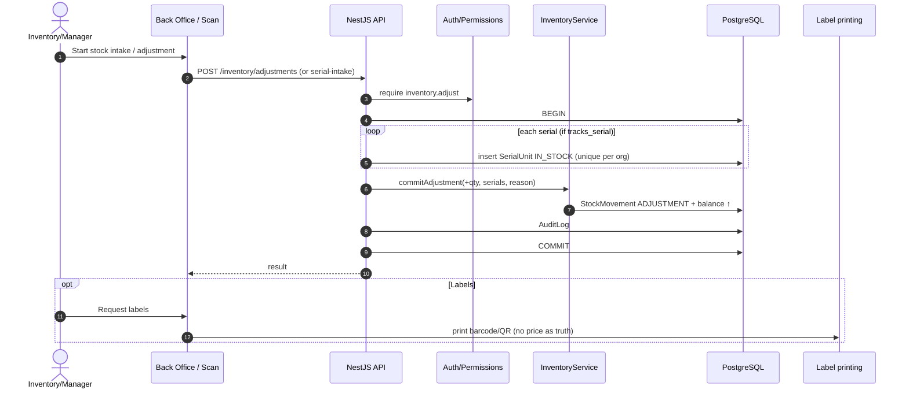
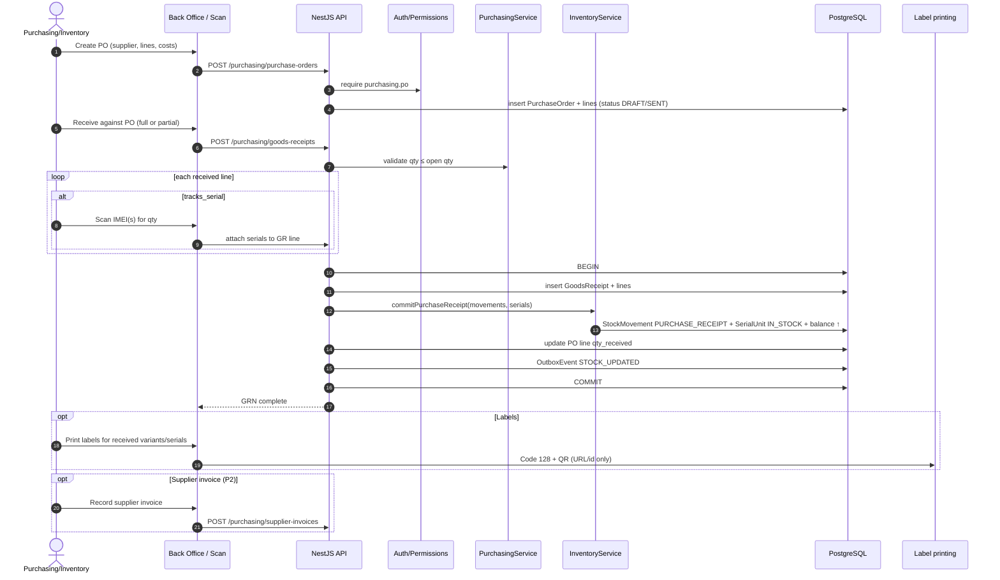

# Workflow: Receive stock

**Goal:** Increase warehouse stock (and capture IMEIs) so devices can be sold.  
**Owners:** `purchasing-agent` (PO/GRN, Phase 2) · `inventory-agent` (ledger/serials) · `barcode-agent` (labels) · Mobile UI: `frontend-pos-agent`.  
**Related PRD:** `docs/product-requirements.md` §5.3, §9, §14.

## Phasing

| Path | Phase | When to use |
| --- | --- | --- |
| **A. Adjustment / CSV serial intake** | **Phase 1 MVP** | Pilot stocking without suppliers module |
| **B. PO → Goods receipt** | **Phase 2** | Full purchasing: PO, partial receive, supplier invoice |

Both paths **must** create `StockMovement` rows (`ADJUSTMENT` or `PURCHASE_RECEIPT`) and never mutate balances directly.

---

## Path A — Phase 1 intake (MVP)

```text
Select variant / warehouse → Enter qty and/or scan IMEIs
→ Confirm reason → Ledger ↑ → Optional label print
```



---

## Path B — Phase 2 purchase receive (target)

```text
PO → Send → Receive (full/partial) → Scan IMEI
→ Stock movements PURCHASE_RECEIPT → Labels → Supplier invoice
```



## Rules (short)

1. Serial/IMEI unique per organization; status starts `IN_STOCK`.  
2. Partial receive allowed on Path B; over-receive rejected unless policy says otherwise.  
3. Labels: manufacturer or internal barcode; QR never authoritative for price.  
4. Phase 1 MVP acceptance uses Path A (or CSV) plus later sell → return E2E.  
5. Path B UI/API is out of Phase 1 scope but ERD-marked in `docs/database.md`.
