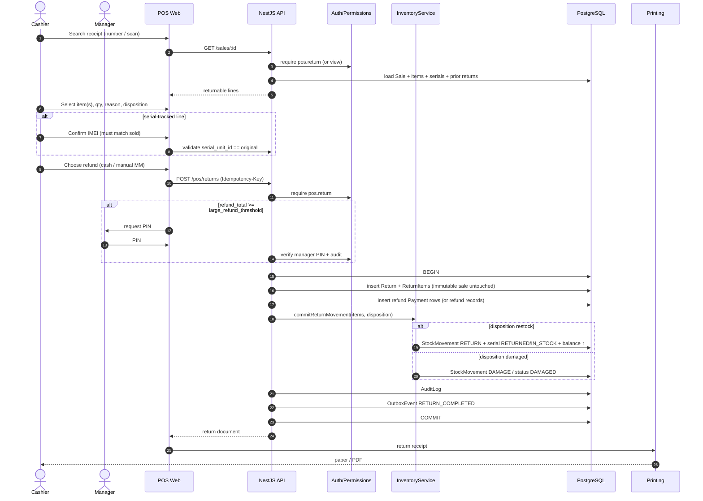

# Workflow: Return (Phase 1)

**Goal:** Refund/restock against an original completed sale with IMEI integrity.  
**Owners:** `sales-agent` · `inventory-agent` · `security-agent` (Manager PIN) · `frontend-pos-agent`.  
**Related PRD:** `docs/product-requirements.md` §8.

```text
Search receipt → Item → Reason → Inspect/disposition
→ Refund method → Stock/serial update → Return receipt
```

## Sequence



## Rules (short)

1. Original sale remains immutable; return is a new document.  
2. Qty returned ≤ sold − already returned.  
3. **IMEI returned must match IMEI sold** on that line — mismatch → reject.  
4. Large refunds require Manager PIN (threshold in org settings).  
5. Stock only via ledger movements; no direct qty edits.  
6. Phase 1: exchange = return + new sale (first-class exchange is Phase 2).
